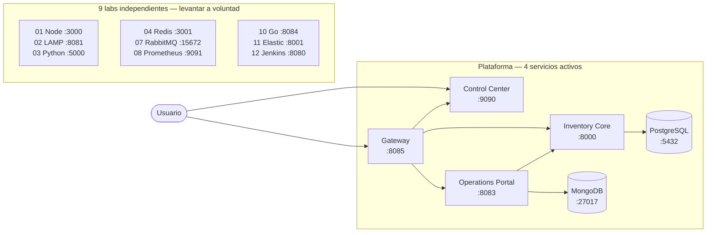

# Docker Labs

> Plataforma modular de sistemas Docker para aprendizaje práctico, prototipado y evolución de productos.

[](https://github.com/vladimiracunadev-create/docker-labs/actions/workflows/ci.yml)
[](https://github.com/vladimiracunadev-create/docker-labs/releases/latest)
[](LICENSE)

---

## Estado — v1.5.0

**Todos los labs están operativos.** Se levantan y bajan con `docker compose up / down` a voluntad. Los 4 de la plataforma arrancan juntos con el launcher Windows.

| Lab | Stack | Puerto(s) host | Estado | CI |
|---|---|---|---|---|
| `dashboard-control` | Node.js + Docker API | `9090` | ✅ Operativo · Plataforma | smoke |
| `05-postgres-api` | Python + PostgreSQL | `8000`, `5432` | ✅ Operativo · Plataforma | test + smoke |
| `09-multi-service-app` | Node.js + MongoDB + Nginx | `8083`, `3003`, `27017` | ✅ Operativo · Plataforma | test + smoke |
| `06-nginx-proxy` | Nginx | `8085` | ✅ Operativo · Plataforma | test + smoke |
| `01-node-api` | Node.js | `3000` | ✅ Operativo · Lab independiente | test |
| `02-php-lamp` | PHP + Apache + MariaDB | `8081`, `8082`, `3306` | ✅ Operativo · Lab independiente | test |
| `03-python-api` | Python Flask | `5000` | ✅ Operativo · Lab independiente | test |
| `04-redis-cache` | Node.js + Redis | `3001`, `6379` | ✅ Operativo · Lab independiente | test |
| `07-rabbitmq-messaging` | RabbitMQ + Node.js | `5672`, `15672` | ✅ Operativo · Lab independiente | test |
| `08-prometheus-grafana` | Prometheus + Grafana | `9091`, `3002` | ✅ Operativo · Lab independiente | test |
| `10-go-api` | Go | `8084` | ✅ Operativo · Lab independiente | test |
| `11-elasticsearch-search` | Python + Elasticsearch | `8001`, `9200` | ✅ Operativo · requiere ≥ 6 GB RAM | manual |
| `12-jenkins-ci` | Jenkins LTS | `8080`, `50000` | ✅ Operativo · arranque > 3 min | manual |

**Plataforma** = los 4 servicios que corren juntos como sistema central.
**Lab independiente** = operativo, se levanta solo con `docker compose up`.
**manual** = operativo pero excluido del CI automático por requisitos de recursos.

---

## Arquitectura



---

## Instalación en Windows

1. Descarga `docker-labs-setup-{version}.exe` desde **[GitHub Releases](https://github.com/vladimiracunadev-create/docker-labs/releases/latest)**
2. Ejecuta el instalador — acepta SmartScreen si aparece (ver [nota](docs/windows-installer.md#por-que-no-se-usa-firma-digital-en-esta-fase))
3. Usa el acceso directo **Docker Labs** del escritorio o menú de inicio
4. El launcher levanta los 4 servicios de plataforma y abre el browser automáticamente

---

## Quickstart manual

```bash
# Control Center
./scripts/start-control-center.sh        # Linux / macOS
scripts\start-control-center.cmd         # Windows

# Plataforma completa
docker compose -f 05-postgres-api/docker-compose.yml up -d --build
docker compose -f 09-multi-service-app/docker-compose.yml up -d --build
docker compose -f 06-nginx-proxy/docker-compose.yml up -d --build

# Cualquier lab independiente (ejemplo)
docker compose -f 04-redis-cache/docker-compose.yml up -d --build
```

| Sistema | URL |
|---|---|
| Control Center | <http://localhost:9090> |
| Learning Center | <http://localhost:9090/learning-center.html> |
| Inventory Core | <http://localhost:8000> — Swagger: <http://localhost:8000/docs> |
| Operations Portal | <http://localhost:8083> |
| Platform Gateway | <http://localhost:8085> |

---

## Documentación esencial

| Documento | Para quién |
|---|---|
| [Beginner Guide](docs/BEGINNERS_GUIDE.md) | Primeros pasos con Docker y el repo |
| [User Manual](docs/USER_MANUAL.md) | Uso diario del panel y los sistemas |
| [Technical Specs](docs/TECHNICAL_SPECS.md) | Puertos, stacks, endpoints y health checks completos |
| [Windows Installer](docs/windows-installer.md) | Instalación, build y distribución del `.exe` |
| [Changelog](CHANGELOG.md) | Historial de cambios por versión |
| [Project Status](PROJECT_STATUS.md) | Qué está consolidado y qué sigue en evolución |
| [Recruiter Guide](RECRUITER.md) | Recorrido rápido del valor del repo |

---

## Licencia

Proyecto bajo [Apache License 2.0](LICENSE).
