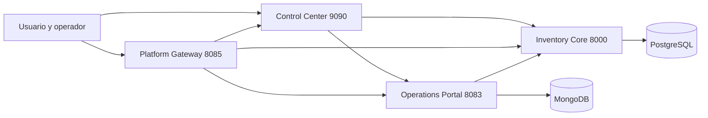

# Docker Labs

> Plataforma modular de sistemas Docker para aprendizaje práctico, prototipado y evolución de productos.

[](https://github.com/vladimiracunadev-create/docker-labs/actions/workflows/ci.yml)
[](https://github.com/vladimiracunadev-create/docker-labs/releases/latest)
[](LICENSE)
[](http://localhost:9090)
[](PROJECT_STATUS.md)

---

## 🚀 Implementación Profesional del Workspace (v1.4)

> **Estado**: 🟢 Operativo  
> **CI**: 🟢 Activo  
> **Audiencia**: 👥 Principiantes, DevOps, backend, full stack, reclutadores  
> **Entrada principal**: 🖥️ [http://localhost:9090](http://localhost:9090)

**Executive Summary**: `docker-labs` ya no se presenta como una colección de demos sueltas. Hoy funciona como un workspace modular con una historia principal clara: un panel dockerizado para operar el entorno, un core transaccional, un portal operativo y un gateway común.

## 🎯 Qué resuelve este repositorio

| Capa | Componente | Valor |
|---|---|---|
| Workspace | `dashboard-control` | Permite levantar, detener, diagnosticar y entender el estado del entorno Docker |
| Core | `05-postgres-api` | Provee un backend transaccional con clientes, productos, pedidos y stock |
| Operación | `09-multi-service-app` | Agrega una experiencia operativa sobre el core |
| Entrada común | `06-nginx-proxy` | Unifica acceso al panel, al core y al portal |
| Aprendizaje | `learning-center.html` | Entrega contexto formativo dentro del ambiente local |

## 💻 Instalación en Windows

Descarga el instalador desde GitHub Releases y sigue el asistente:

1. Descarga `docker-labs-setup-{version}.exe` desde **[GitHub Releases](https://github.com/vladimiracunadev-create/docker-labs/releases/latest)**
2. Ejecuta el instalador (acepta el aviso de SmartScreen si aparece — ver nota)
3. Usa el acceso directo **Docker Labs** del menú de inicio o el escritorio
4. El launcher verifica Docker Desktop, levanta la plataforma completa (4 servicios) y abre el browser

> **Nota sobre firma digital**: el instalador no tiene firma digital en v1.x. Esta es una decisión explícita de producto. Si Windows SmartScreen muestra una advertencia, selecciona "Más información" → "Ejecutar de todas formas". Ver [docs/windows-installer.md](docs/windows-installer.md#por-que-no-se-usa-firma-digital-en-esta-fase).

---

## ⚡ Quickstart recomendado

Si quieres ver el repo funcionando sin perderte, sigue este orden exacto:

### Paso 1 — Levantar el Control Center

```bash
# Windows
scripts\start-control-center.cmd

# Linux / macOS
./scripts/start-control-center.sh
```

### Paso 2 — Levantar los labs de la experiencia principal

```bash
docker compose -f 05-postgres-api/docker-compose.yml up -d --build
docker compose -f 09-multi-service-app/docker-compose.yml up -d --build
docker compose -f 06-nginx-proxy/docker-compose.yml up -d --build
```

> Los labs toman ~30-60 segundos en quedar listos. Puedes monitorear su estado desde el Control Center.

### Paso 3 — Explorar

1. Abre [http://localhost:9090](http://localhost:9090) → Control Center
2. Revisa el diagnóstico del host y de Docker
3. Accede a `Inventory Core`, `Operations Portal` y `Platform Gateway` desde el panel
4. Explora el Learning Center en [http://localhost:9090/learning-center.html](http://localhost:9090/learning-center.html)

Entradas principales:

- Control Center: [http://localhost:9090](http://localhost:9090)
- Learning Center: [http://localhost:9090/learning-center.html](http://localhost:9090/learning-center.html)
- Inventory Core: [http://localhost:8000](http://localhost:8000)
- Swagger del core: [http://localhost:8000/docs](http://localhost:8000/docs)
- Operations Portal: [http://localhost:8083](http://localhost:8083)
- Platform Gateway: [http://localhost:8085](http://localhost:8085)

## 📊 Estado actual del workspace

| Componente | Estado | Rol | Entrada |
|---|---|---|---|
| `dashboard-control` | 🟢 OPERATIVO | Control Center dockerizado | [http://localhost:9090](http://localhost:9090) |
| `05-postgres-api` | 🟢 OPERATIVO | Core transaccional | [http://localhost:8000](http://localhost:8000) |
| `09-multi-service-app` | 🟢 OPERATIVO | Portal operativo | [http://localhost:8083](http://localhost:8083) |
| `06-nginx-proxy` | 🟢 OPERATIVO | Gateway | [http://localhost:8085](http://localhost:8085) |
| Learning Center | 🟢 OPERATIVO | Centro de aprendizaje | [http://localhost:9090/learning-center.html](http://localhost:9090/learning-center.html) |

### ✅ Capacidades visibles

| Capacidad | Estado | Detalle |
|---|---|---|
| Panel dockerizado | 🟢 Activo | El Control Center corre como contenedor propio |
| Diagnóstico de host y Docker | 🟢 Activo | `GET /api/diagnostics` combina navegador y runtime Docker |
| Control por lab | 🟢 Activo | `start`, `stop`, `restart`, `rebuild`, `logs` |
| Control global | 🟢 Activo | `bajar todos` y `eliminar entornos del repo` |
| Gateway integrado | 🟢 Activo | `06` enruta a panel, core y portal |
| Core documentado | 🟢 Activo | `05` tiene portada HTML, `health`, `ready`, `summary` y Swagger |
| Portal conectado | 🟢 Activo | `09` consume el core y agrega capa operativa |
| CI — tests por lab | 🟢 Activo | Pipeline Compose en [.github/workflows/ci.yml](.github/workflows/ci.yml) — valida los 10 labs soportados en cada push |
| CI — smoke test cross-service | 🟢 Activo | Job `smoke-platform` valida el flujo completo Core → Portal → Gateway en cada push |
| Health checks 12/12 labs | 🟢 Activo | Todos los labs tienen healthcheck definido; el dashboard puede monitorear el estado real de cada uno |
| **Instalador Windows** | 🟢 Activo | `docker-labs-setup-{v}.exe` generado y publicado automáticamente en [GitHub Releases](https://github.com/vladimiracunadev-create/docker-labs/releases/latest) |
| **Launcher Go** | 🟢 Activo | Levanta los 4 servicios core en paralelo, calcula rutas dinamicamente y abre el browser |
| **CI Windows** | 🟢 Activo | `build-windows.yml` compila y publica el installer al pushear un tag `v*.*.*` |
| **Skills Claude Code** | 🟢 Activos | `docker-labs-release` y `docker-labs-status` — automatizan el flujo de release y el diagnostico del sistema |
| Estándar editorial en los 12 labs | 🟡 En evolución | La columna vertebral ya está elevada; aún faltan mejoras en algunos labs secundarios |

## 🗺️ Referencia rápida — los 12 labs

Estado y puertos de cada lab. Todos tienen health check definido.

| Lab | Descripcion | Puerto(s) host | Estado |
|---|---|---|---|
| `dashboard-control` | Control Center del workspace | `9090` | 🟢 Plataforma |
| `05-postgres-api` | Core transaccional — FastAPI + PostgreSQL | `8000`, `5432` | 🟢 Plataforma |
| `09-multi-service-app` | Portal operativo — Node.js + MongoDB | `8083` (UI), `3003` (API), `27017` | 🟢 Plataforma |
| `06-nginx-proxy` | Gateway unificado — Nginx | `8085` | 🟢 Plataforma |
| `04-redis-cache` | Cache y performance — Node.js + Redis | `3001` (API), `6379` | 🟡 Complementario |
| `07-rabbitmq-messaging` | Mensajeria asincrona — RabbitMQ | `5672` (AMQP), `15672` (UI) | 🟡 Complementario |
| `08-prometheus-grafana` | Observabilidad — Prometheus + Grafana | `9091`, `3002` | 🟡 Complementario |
| `11-elasticsearch-search` | Busqueda — Python + Elasticsearch | `8001` (API), `9200` | 🟡 Complementario |
| `12-jenkins-ci` | CI/CD — Jenkins LTS | `8080` (UI), `50000` | 🟡 Complementario |
| `01-node-api` | Starter — API REST Node.js | `3000` | 🔵 Starter |
| `02-php-lamp` | Starter — PHP + Apache + MariaDB | `8081` (web), `8082` (phpMyAdmin), `3306` | 🔵 Starter |
| `03-python-api` | Starter — API REST Python Flask | `5000` | 🔵 Starter |
| `10-go-api` | Starter — API REST Go | `8084` | 🔵 Starter |

> **Conflictos resueltos**: `08` usa `9091` (no `9090`) y `11` usa `8001` (no `8000`) para evitar colision con la plataforma principal.

---

## 🧭 Ruta recomendada por perfil

| Perfil | Documento o entrada | Objetivo |
|---|---|---|
| Principiante | [docs/BEGINNERS_GUIDE.md](docs/BEGINNERS_GUIDE.md) | Entender Docker, el flujo caso a caso y el orden recomendado |
| Usuario del workspace | [http://localhost:9090](http://localhost:9090) | Ver estado, diagnóstico y accesos del entorno |
| Usuario Windows | [docs/windows-installer.md](docs/windows-installer.md) | Instalar y ejecutar la plataforma desde el instalador `.exe` |
| Dev / DevOps | [docs/DASHBOARD_SETUP.md](docs/DASHBOARD_SETUP.md) | Entender el panel, Compose, gateway y operación |
| Backend | [05-postgres-api/README.md](05-postgres-api/README.md) | Revisar el core transaccional, contratos y salud |
| Full stack / producto | [09-multi-service-app/README.md](09-multi-service-app/README.md) | Revisar la experiencia operativa sobre el core |
| Reclutador / manager | [RECRUITER.md](RECRUITER.md) | Recorrer el valor del repo en pocos minutos |

## 🏗️ Arquitectura del workspace



## 🧩 Taxonomía del repositorio

### 🧠 Sistemas principales

| Carpeta | Tipo | Objetivo |
|---|---|---|
| [05-postgres-api](05-postgres-api/README.md) | Plataforma | Resolver clientes, productos, pedidos y stock |
| [09-multi-service-app](09-multi-service-app/README.md) | Plataforma | Dar una experiencia operativa sobre el core |
| [06-nginx-proxy](06-nginx-proxy/README.md) | Plataforma | Unificar accesos hacia panel, core y portal |
| [dashboard-control](dashboard-control/server.js) | Workspace | Operar Docker y entender capacidad del entorno |

### 🧰 Servicios de infraestructura

| Carpeta | Capacidad | Estado narrativo |
|---|---|---|
| `04-redis-cache` | Caché y performance | Complementario |
| `07-rabbitmq-messaging` | Mensajería asíncrona | Complementario |
| `08-prometheus-grafana` | Observabilidad | Complementario |
| `11-elasticsearch-search` | Búsqueda | Complementario |
| `12-jenkins-ci` | CI y automatización | Complementario |

### 🧪 Starters y demos

| Carpeta | Enfoque |
|---|---|
| `01-node-api` | API REST inicial |
| `02-php-lamp` | Entorno clásico administrativo |
| `03-python-api` | API Python sencilla |
| `10-go-api` | Servicio ligero y rápido |

## 📚 Documentación del Proyecto

El objetivo de esta sección es que no tengas que adivinar qué leer. Cada documento responde una necesidad concreta y se puede abrir directamente desde aquí.

### 🚀 Inicio y operación

| Documento | Audiencia | Qué resuelve | Abrir |
|---|---|---|---|
| Documentation Index | Todos | Mapa maestro de lectura | [Abrir](docs/DOCUMENTATION_INDEX.md) |
| Beginner Guide | Principiantes | Primeros pasos con Docker y con el repo | [Abrir](docs/BEGINNERS_GUIDE.md) |
| Install Guide | Todos | Instalación y arranque correcto del workspace | [Abrir](docs/INSTALL.md) |
| Requirements | Todos | Requisitos mínimos y recomendados del host y de Docker | [Abrir](docs/REQUIREMENTS.md) |
| Environment Setup | Operadores | Preparación del equipo y orden sugerido de arranque | [Abrir](ENVIRONMENT_SETUP.md) |
| User Manual | Usuarios del workspace | Uso diario del panel y de los sistemas activos | [Abrir](docs/USER_MANUAL.md) |
| Dashboard Setup | Dev / DevOps | Cómo funciona el `9090` y cómo gobierna el entorno | [Abrir](docs/DASHBOARD_SETUP.md) |
| Operating Modes | Todos | Cuándo conviene usar modo panel primero, caso a caso o plataforma principal | [Abrir](OPERATING-MODES.md) |
| Runbook | Operadores | Arranque, apagado y respuesta a incidencias comunes | [Abrir](RUNBOOK.md) |

### 🏗️ Arquitectura y referencia técnica

| Documento | Audiencia | Qué resuelve | Abrir |
|---|---|---|---|
| Architecture | Técnico | Relación entre panel, core, portal y gateway | [Abrir](docs/ARCHITECTURE.md) |
| Labs Catalog | Todos | Rol de los 12 labs dentro del ecosistema | [Abrir](docs/LABS_CATALOG.md) |
| Labs Runtime Reference | Operadores | Imágenes oficiales, tamaños y requisitos por lab | [Abrir](docs/LABS_RUNTIME_REFERENCE.md) |
| Technical Specs | Técnico | Stacks, puertos, endpoints y contratos | [Abrir](docs/TECHNICAL_SPECS.md) |
| System Specs | Ejecutivo / técnico | Vista corta del sistema como plataforma | [Abrir](SYSTEM_SPECS.md) |
| File Architecture | Técnico | Mapa de carpetas y responsabilidades | [Abrir](FILE_ARCHITECTURE.md) |
| Tooling | Técnico | Herramientas principales de runtime y desarrollo | [Abrir](docs/TOOLING.md) |
| Compatibility | Operadores | Compatibilidad por sistema operativo, puertos y modos | [Abrir](COMPATIBILITY.md) |
| Glossary | Principiantes | Términos base del workspace y Docker | [Abrir](GLOSSARY.md) |

### 🪟 Distribución Windows

| Documento | Audiencia | Qué resuelve | Abrir |
|---|---|---|---|
| Windows Installer | Usuarios Windows, reclutadores | Cómo instalar, compilar, distribuir y justificar ausencia de firma digital | [Abrir](docs/windows-installer.md) |
| GitHub Releases Distribution | Maintainers | Estrategia de distribución vía releases, sin binarios en el repo | [Abrir](docs/github-releases-distribution.md) |
| Technical Audit | Técnico | Estado diagnosticado del repo y correcciones aplicadas | [Abrir](docs/technical-audit.md) |

### 🤖 Automatización con Claude Code

| Skill | Qué hace | Cómo activarlo |
|---|---|---|
| `docker-labs-release` | Bump de versión, commit, tag, push → dispara el CI que publica el `.exe` | _"haz un release"_, _"nueva versión"_, _"bump version"_ |
| `docker-labs-status` | Estado de contenedores, health HTTP, último build CI, versión y commits | _"estado de docker-labs"_, _"qué está corriendo"_, _"health check"_ |

> Ver [DEVELOPING.md](DEVELOPING.md#skills-de-automatizacion-claude-code) para instrucciones de uso.

### 📈 Estado, release y gobernanza

| Documento | Audiencia | Qué resuelve | Abrir |
|---|---|---|---|
| Project Status | Todos | Qué está consolidado hoy y qué sigue en evolución | [Abrir](PROJECT_STATUS.md) |
| Platform Roadmap | Todos | Dirección futura y prioridades de madurez | [Abrir](docs/PLATFORM_ROADMAP.md) |
| Changelog | Todos | Historial de cambios relevantes | [Abrir](CHANGELOG.md) |
| Release Guide | Maintainers | Checklist de publicación coherente | [Abrir](RELEASE.md) |
| Killed Practices | Técnico / liderazgo | Prácticas y enfoques que el repo evita | [Abrir](killed.md) |
| Support | Maintainers | Criterios de soporte y continuidad | [Abrir](SUPPORT.md) |
| Developing | Devs | Cómo extender y mantener el workspace | [Abrir](DEVELOPING.md) |
| Security | DevSecOps | Alcance y política de seguridad | [Abrir](SECURITY.md) |
| Contributing | Colaboradores | Flujo de contribución y estándar de trabajo | [Abrir](CONTRIBUTING.md) |
| Code of Conduct | Comunidad | Marco de convivencia del proyecto | [Abrir](CODE_OF_CONDUCT.md) |

### 👀 Evaluación externa

| Documento | Audiencia | Qué resuelve | Abrir |
|---|---|---|---|
| Recruiter Guide | Reclutadores / managers | Recorrido rápido del valor de portafolio y madurez técnica | [Abrir](RECRUITER.md) |

## ✅ Lo que este repo es hoy

- un workspace usable para aprender y operar stacks Docker
- un activo de portafolio técnico con una historia principal clara
- una base seria para seguir integrando servicios y fortalecer prácticas DevOps

## 🚧 Lo que todavía no busca ser

- un reemplazo completo de Docker Desktop
- una plataforma productiva terminada en sus 12 labs
- un ecosistema ya homogéneo en todas sus carpetas

## 📄 Licencia

Proyecto bajo [Apache License 2.0](LICENSE).
