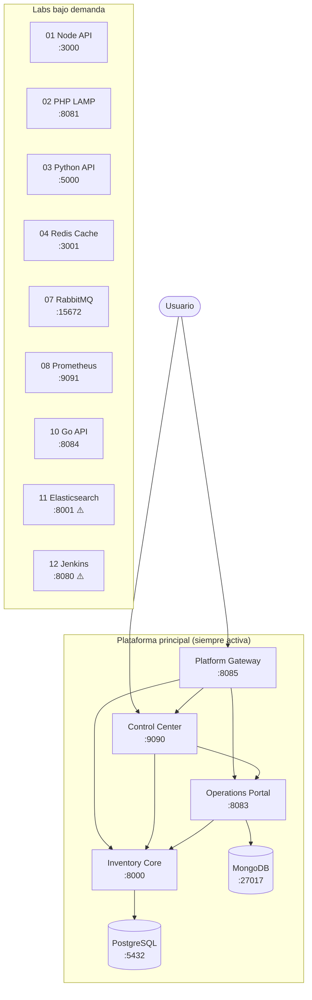

# Docker Labs

> Plataforma modular de sistemas Docker para aprendizaje práctico, prototipado y evolución de productos.

[](https://github.com/vladimiracunadev-create/docker-labs/actions/workflows/ci.yml)
[](https://github.com/vladimiracunadev-create/docker-labs/releases/latest)
[](LICENSE)

---

## Estado de la plataforma — v1.4.2

Todos los componentes tienen health check. Los 4 de la plataforma principal arrancan juntos con el launcher.

| # | Componente | Puerto(s) host | Estado | CI |
|---|---|---|---|---|
| — | `dashboard-control` | `9090` | 🟢 Plataforma activa | ✅ smoke |
| 05 | `postgres-api` | `8000`, `5432` | 🟢 Plataforma activa | ✅ test + smoke |
| 09 | `multi-service-app` | `8083`, `3003`, `27017` | 🟢 Plataforma activa | ✅ test + smoke |
| 06 | `nginx-proxy` | `8085` | 🟢 Plataforma activa | ✅ test + smoke |
| 01 | `node-api` | `3000` | 🔵 Bajo demanda | ✅ test |
| 02 | `php-lamp` | `8081`, `8082`, `3306` | 🔵 Bajo demanda | ✅ test |
| 03 | `python-api` | `5000` | 🔵 Bajo demanda | ✅ test |
| 04 | `redis-cache` | `3001`, `6379` | 🔵 Bajo demanda | ✅ test |
| 07 | `rabbitmq-messaging` | `5672`, `15672` | 🔵 Bajo demanda | ✅ test |
| 08 | `prometheus-grafana` | `9091`, `3002` | 🔵 Bajo demanda | ✅ test |
| 10 | `go-api` | `8084` | 🔵 Bajo demanda | ✅ test |
| 11 | `elasticsearch-search` | `8001`, `9200` | 🔵 Bajo demanda | ⚠️ manual — requiere ≥ 6 GB RAM |
| 12 | `jenkins-ci` | `8080`, `50000` | 🔵 Bajo demanda | ⚠️ manual — arranque > 3 min |

> 🟢 **Plataforma activa** = levanta junto al launcher Windows o con el quickstart. 🔵 **Bajo demanda** = funciona con `docker compose up`, no corre por defecto. ⚠️ **Manual** = operativo pero excluido del CI por requisitos de recursos.

---

## Instalación en Windows

1. Descarga `docker-labs-setup-{version}.exe` desde **[GitHub Releases](https://github.com/vladimiracunadev-create/docker-labs/releases/latest)**
2. Ejecuta el instalador y sigue el asistente (acepta SmartScreen si aparece — ver [nota](docs/windows-installer.md#por-que-no-se-usa-firma-digital-en-esta-fase))
3. Usa el acceso directo **Docker Labs** del escritorio o menú de inicio
4. El launcher levanta los 4 servicios de plataforma y abre el browser en `http://localhost:9090`

---

## Quickstart manual (Linux / macOS / Windows sin installer)

```bash
# 1. Levantar el Control Center
./scripts/start-control-center.sh        # Linux / macOS
scripts\start-control-center.cmd         # Windows

# 2. Levantar la plataforma principal
docker compose -f 05-postgres-api/docker-compose.yml up -d --build
docker compose -f 09-multi-service-app/docker-compose.yml up -d --build
docker compose -f 06-nginx-proxy/docker-compose.yml up -d --build

# 3. Levantar un lab individual (ejemplo)
docker compose -f 04-redis-cache/docker-compose.yml up -d --build
```

Entradas principales una vez levantada la plataforma:

| Sistema | URL |
|---|---|
| Control Center | <http://localhost:9090> |
| Learning Center | <http://localhost:9090/learning-center.html> |
| Inventory Core | <http://localhost:8000> |
| Swagger del core | <http://localhost:8000/docs> |
| Operations Portal | <http://localhost:8083> |
| Platform Gateway | <http://localhost:8085> |

---

## Arquitectura



> ⚠️ Labs 11 y 12 son operativos pero requieren recursos adicionales — ver tabla de estado.

---

## Documentación esencial

| Documento | Para quién |
|---|---|
| [Beginner Guide](docs/BEGINNERS_GUIDE.md) | Primeros pasos con Docker y el repo |
| [User Manual](docs/USER_MANUAL.md) | Uso diario del panel y los sistemas |
| [Technical Specs](docs/TECHNICAL_SPECS.md) | Puertos, stacks, endpoints y health checks |
| [Windows Installer](docs/windows-installer.md) | Instalación, build y distribución del `.exe` |
| [Architecture](docs/ARCHITECTURE.md) | Relación entre los componentes |
| [Changelog](CHANGELOG.md) | Historial de cambios por versión |
| [Project Status](PROJECT_STATUS.md) | Qué está consolidado y qué sigue en evolución |
| [Recruiter Guide](RECRUITER.md) | Recorrido rápido del valor del repo |

---

## Automatización con Claude Code

| Skill | Qué hace |
|---|---|
| `docker-labs-release` | Bump de versión, commit, tag, push → publica el `.exe` automáticamente |
| `docker-labs-status` | Estado de contenedores, health HTTP, último build CI y commits recientes |

---

## Licencia

Proyecto bajo [Apache License 2.0](LICENSE).
