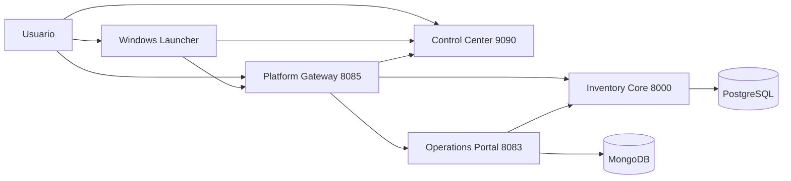

# Docker Labs

> Plataforma modular de sistemas Docker para aprendizaje practico, prototipado y demos tecnicas con una capa profesional de distribucion Windows.

[](https://github.com/vladimiracunadev-create/docker-labs/actions/workflows/ci.yml)
[](LICENSE)
[](http://localhost:9090)
[](docs/windows-installer.md)

---

## Executive Summary

`docker-labs` ya no se presenta como una coleccion de demos aisladas. El repo funciona como un workspace Docker modular con una historia principal clara:

- `dashboard-control` como Control Center y punto de entrada
- `05-postgres-api` como core transaccional
- `09-multi-service-app` como portal operativo
- `06-nginx-proxy` como gateway comun
- una capa Windows aditiva con launcher, staging e instalador `.exe`

## Que resuelve este repositorio

| Capa | Componente | Valor |
|---|---|---|
| Workspace | `dashboard-control` | Levantar, detener, diagnosticar y explicar el entorno Docker |
| Core | `05-postgres-api` | Backend transaccional con clientes, productos, pedidos y stock |
| Operacion | `09-multi-service-app` | Experiencia operativa visible sobre el core |
| Entrada comun | `06-nginx-proxy` | Unifica panel, core y portal |
| Distribucion | launcher + installer Windows | Hace el proyecto instalable y demostrable desde GitHub Releases |

## Quickstart recomendado desde fuente

### Windows

```powershell
scripts\start-control-center.cmd
```

### Linux/macOS

```bash
./scripts/start-control-center.sh
```

Despues, si quieres ver la plataforma principal completa:

```powershell
docker compose -f 05-postgres-api\docker-compose.yml up -d --build
docker compose -f 09-multi-service-app\docker-compose.yml up -d --build
docker compose -f 06-nginx-proxy\docker-compose.yml up -d --build
```

## Windows installer y launcher

La distribucion Windows se publica como asset de GitHub Releases. Flujo esperado:

1. Descargar el instalador oficial:

   `https://github.com/vladimiracunadev-create/docker-labs/releases/latest/download/docker-labs-windows-latest.exe`

2. Instalar `Docker Labs`.
3. Abrir `DockerLabsLauncher.exe`.
4. Validar `docker` y `docker compose`.
5. Usar `Start Control Center` o `Start main workspace`.

Importante:

- esta fase **no usa firma digital**
- Windows puede mostrar advertencias de SmartScreen o editor no reconocido
- el canal oficial de distribucion es GitHub Releases
- cada release incluye `SHA256SUMS.txt`

## Entradas principales

- Control Center: [http://localhost:9090](http://localhost:9090)
- Learning Center: [http://localhost:9090/learning-center.html](http://localhost:9090/learning-center.html)
- Inventory Core: [http://localhost:8000](http://localhost:8000)
- Swagger del core: [http://localhost:8000/docs](http://localhost:8000/docs)
- Operations Portal: [http://localhost:8083](http://localhost:8083)
- Platform Gateway: [http://localhost:8085](http://localhost:8085)

## Arquitectura principal



## Documentacion clave

| Si quieres... | Documento |
|---|---|
| Entender el estado encontrado y las correcciones aplicadas | [docs/technical-audit.md](docs/technical-audit.md) |
| Instalar o construir la capa Windows | [docs/windows-installer.md](docs/windows-installer.md) |
| Publicar assets en GitHub Releases | [docs/github-releases-distribution.md](docs/github-releases-distribution.md) |
| Instalar y operar el workspace desde fuente | [docs/INSTALL.md](docs/INSTALL.md) |
| Operar el dia a dia | [RUNBOOK.md](RUNBOOK.md) |
| Entender arquitectura y puertos | [docs/TECHNICAL_SPECS.md](docs/TECHNICAL_SPECS.md) |
| Revisar la estructura del repo | [FILE_ARCHITECTURE.md](FILE_ARCHITECTURE.md) |
| Evaluarlo como proyecto de portafolio | [RECRUITER.md](RECRUITER.md) |

## Taxonomia del repo

### Sistemas principales

- `dashboard-control`
- `05-postgres-api`
- `09-multi-service-app`
- `06-nginx-proxy`

### Infraestructura complementaria

- `04-redis-cache`
- `07-rabbitmq-messaging`
- `08-prometheus-grafana`
- `11-elasticsearch-search`
- `12-jenkins-ci`

### Starters y demos

- `01-node-api`
- `02-php-lamp`
- `03-python-api`
- `10-go-api`

## Notas de coherencia

- El flujo soportado actual es el del `dashboard-control` en `9090`.
- Los `docker-compose-dashboard*.yml` de raiz quedan como legado y no forman parte del instalador Windows.
- `08` y `11` siguen siendo utiles, pero se documentan como labs de uso caso a caso por sus conflictos de puertos con la plataforma principal.

## Por que esto suma valor profesional

Esta version del repo ya no demuestra solo Docker Compose. Tambien demuestra:

- criterio de arquitectura para transformar labs en plataforma
- empaquetado Windows aditivo y mantenible
- staging de artefactos y release automation
- documentacion defendible para reclutadores y revisores tecnicos
- criterio de distribucion por GitHub Releases en lugar de inflar el repo o GitHub Pages con binarios

## Licencia

Proyecto bajo [Apache License 2.0](LICENSE).
