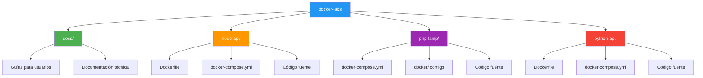
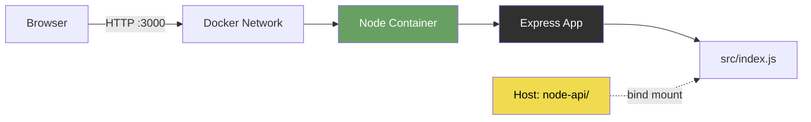
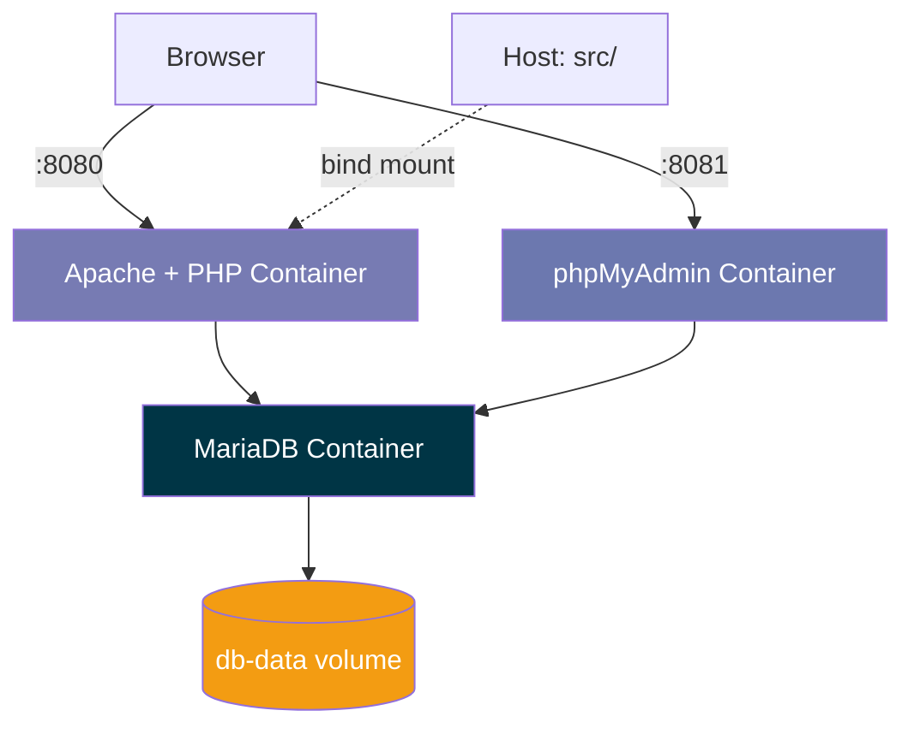
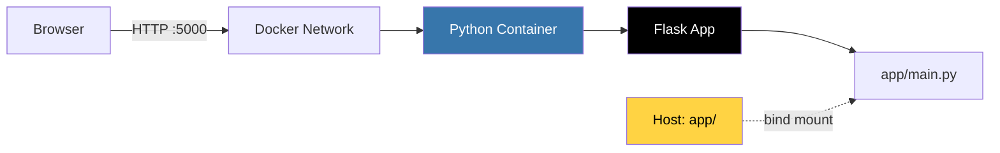
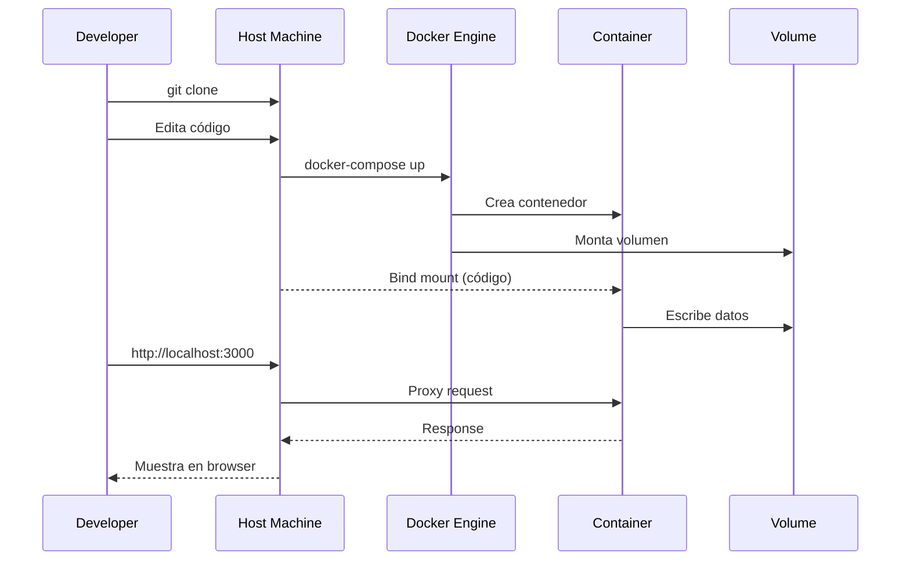

# Arquitectura 🏗️

Documentación técnica sobre el diseño y arquitectura de **docker-labs**.

---

## 🎯 Filosofía de Diseño

docker-labs sigue tres principios fundamentales:

1. **🔗 Independencia Modular**: Cada laboratorio puede funcionar de forma aislada
2. **📦 Separación de Responsabilidades**: Código (host) / Runtime (contenedor) / Datos (volúmenes)
3. **🎓 Aprendizaje Progresivo**: De básico a avanzado

---

## 🗂️ Estructura General del Repositorio



---

## 🧩 Capas de Arquitectura

### Capa 1: Host (Tu máquina)

```
┌─────────────────────────────────────┐
│         Sistema Operativo           │
│  (Windows / macOS / Linux)          │
│                                     │
│  ├── Docker Engine                  │
│  ├── Código fuente (git clone)     │
│  └── Editor (VS Code)               │
└─────────────────────────────────────┘
```

**Responsabilidades**:
- Almacenar el código fuente
- Ejecutar Docker Engine
- Editar archivos

---

### Capa 2: Docker (Contenedores)

```
┌─────────────────────────────────────┐
│        Docker Engine                │
│                                     │
│  ┌──────────┐  ┌──────────┐        │
│  │Container │  │Container │        │
│  │  Web     │  │   DB     │        │
│  └──────────┘  └──────────┘        │
│       ↓              ↓              │
│  ┌──────────────────────┐          │
│  │  Docker Network      │          │
│  └──────────────────────┘          │
└─────────────────────────────────────┘
```

**Responsabilidades**:
- Ejecutar aplicaciones aisladas
- Gestionar redes entre contenedores
- Mapear puertos y volúmenes

---

### Capa 3: Volúmenes (Persistencia)

```
┌─────────────────────────────────────┐
│      Docker Volumes                 │
│                                     │
│  ├── db-data (MariaDB)              │
│  ├── bind mounts (código)           │
│  └── named volumes (logs)           │
└─────────────────────────────────────┘
```

**Responsabilidades**:
- Persistir datos de bases de datos
- Sincronizar código en tiempo real
- Almacenar archivos generados

---

## 🟢 Arquitectura: node-api

### Diagrama de Componentes



### docker-compose.yml

```yaml
services:
  web:
    build: .
    ports:
      - "3000:3000"
    volumes:
      - ./src:/app/src
    environment:
      - NODE_ENV=development
```

### Flujo de Datos

1. **Editas** `src/index.js` en tu máquina (host)
2. **Bind mount** sincroniza el archivo al contenedor inmediatamente
3. **Nodemon** detecta el cambio y reinicia el servidor
4. **Browser** recibe la respuesta actualizada en `:3000`

### Responsabilidades

| Componente | Responsabilidad |
|------------|-----------------|
| Dockerfile | Definir imagen base (Node 18) + deps |
| docker-compose | Levantar servicio + puertos + volúmenes |
| src/ | Código fuente de la aplicación |
| package.json | Dependencias npm |

---

## 🐘 Arquitectura: php-lamp

### Diagrama de Componentes



### docker-compose.yml

```yaml
services:
  web:
    build: ./docker
    ports:
      - "8080:80"
    volumes:
      - ./src:/var/www/html
    depends_on:
      - db
  
  db:
    image: mariadb:10.6
    environment:
      MYSQL_ROOT_PASSWORD: rootpass
      MYSQL_DATABASE: testdb
    volumes:
      - db-data:/var/lib/mysql
  
  phpmyadmin:
    image: phpmyadmin:latest
    ports:
      - "8081:80"

volumes:
  db-data:
```

### Flujo de Datos

1. **Browser** → `:8080` → **Apache** procesa PHP
2. **PHP** → conecta a **MariaDB** (`db:3306`)
3. **MariaDB** → lee/escribe en volumen `db-data`
4. **phpMyAdmin** → gestiona BD visualmente (`:8081`)

### Responsabilidades

| Componente | Responsabilidad |
|------------|-----------------|
| docker/Dockerfile | Imagen PHP + extensiones |
| docker-compose.yml | Orquestar 3 servicios |
| src/ | Código PHP de la aplicación |
| db-data (volume) | Persistir datos de MariaDB |

---

## 🐍 Arquitectura: python-api

### Diagrama de Componentes



### docker-compose.yml

```yaml
services:
  web:
    build: .
    ports:
      - "5000:5000"
    volumes:
      - ./app:/app
    environment:
      - FLASK_ENV=development
      - FLASK_DEBUG=1
```

### Flujo de Datos

1. **Editas** `app/main.py` en tu máquina
2. **Bind mount** sincroniza al contenedor
3. **Flask debug mode** recarga automáticamente
4. **Browser** ve cambios en `:5000`

### Responsabilidades

| Componente | Responsabilidad |
|------------|-----------------|
| Dockerfile | Imagen Python 3.10 + pip install |
| docker-compose | Levantar servicio con debug |
| app/ | Código Flask |
| requirements.txt | Dependencias Python |

---

## 🌐 Redes Docker

Cada `docker-compose.yml` crea una red privada automáticamente:

```
┌──────────────────────────────┐
│  docker-labs_default network │
│                              │
│  ┌─────────┐  ┌─────────┐   │
│  │   web   │  │   db    │   │
│  │ :3000   │  │ :3306   │   │
│  └─────────┘  └─────────┘   │
│       ↕            ↕         │
└───────┼────────────┼─────────┘
        │            │
        ↓            ↓
   localhost:3000  (no expuesto)
```

**Características**:
- Los contenedores se ven entre sí por **nombre de servicio**
- Comunicación interna por puertos nativos (3306, 80, etc.)
- Solo los puertos mapeados son accesibles desde el host

---

## 📦 Gestión de Volúmenes

### Bind Mounts (Desarrollo)

```yaml
volumes:
  - ./src:/var/www/html  # Host → Contenedor
```

**Ventajas**:
- Edición en tiempo real
- Fácil debugging
- No pierdes el código al destruir contenedor

**Desventajas**:
- Performance en Windows/macOS (solución: WSL2)

---

### Named Volumes (Datos)

```yaml
volumes:
  - db-data:/var/lib/mysql

volumes:
  db-data:
```

**Ventajas**:
- Persistencia garantizada
- Performance nativa
- Gestionados por Docker

**Desventajas**:
- No están en el host directamente
- Requieren `docker volume rm` para eliminar

---

## 🔀 Patrones de Diseño Aplicados

### 1. Separation of Concerns

```
Presentación  → Apache/Nginx/Express
Lógica        → PHP/Node/Python
Datos         → MariaDB/MySQL/PostgreSQL
```

### 2. Configuration as Code

Todo está en archivos versionables:
- `Dockerfile` → Imagen
- `docker-compose.yml` → Orquestación
- `.env` → Variables sensibles (gitignore)

### 3. Immutable Infrastructure

Las imágenes son **inmutables**:
- Cambios en deps → `docker-compose build`
- Cambios en código → Hot reload (bind mount)

---

## 🔐 Seguridad por Capas

1. **Network Isolation**: Servicios en red privada
2. **Port Mapping**: Solo exponemos lo necesario
3. **Environment Variables**: Secretos en `.env` (no en repo)
4. **User Permissions**: Contenedores no corren como root (best practice)

---

## 🚀 Escalabilidad (Conceptual)

Aunque estos labs son para desarrollo local, la arquitectura permite escalar:

```bash
# Escalar servicio web a 3 réplicas
docker-compose up --scale web=3
```

Con un load balancer (Nginx/Traefik), podrías distribuir tráfico.

---

## 📊 Diagrama General de Interacciones



---

## 🎓 Recursos para Profundizar

### Documentación Oficial
- [Docker Architecture](https://docs.docker.com/get-started/overview/)
- [Docker Networking](https://docs.docker.com/network/)
- [Docker Volumes](https://docs.docker.com/storage/volumes/)

### Guías en este repo
- 📋 [Catálogo de Labs](LABS_CATALOG.md) - Detalles de cada laboratorio
- 🔧 [Specs Técnicas](TECHNICAL_SPECS.md) - Versiones y estándares
- 🎯 [Best Practices](BEST_PRACTICES.md) - Mejores prácticas

---

← [Volver al README](../README.md)
