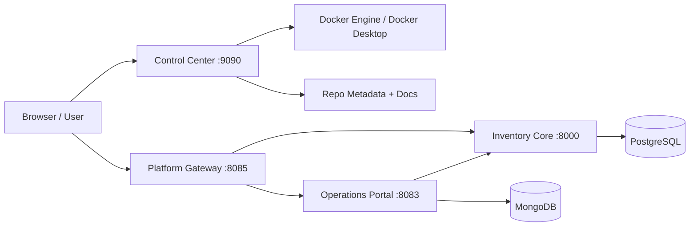
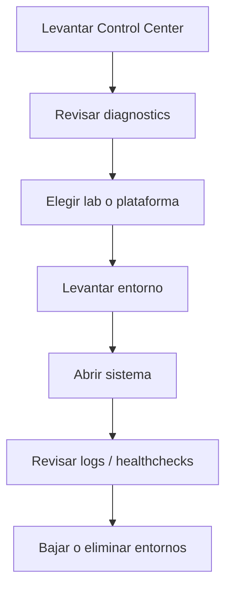

# 🏗️ Architecture

Visión técnica del workspace `docker-labs`.

## 📌 Objetivo de arquitectura

La arquitectura del repositorio busca equilibrar tres cosas:

- aprendizaje práctico
- operación local clara
- evolución de algunos labs hacia productos modulares

## 📊 Estado arquitectónico

| Capa | Estado | Rol |
|---|---|---|
| `dashboard-control` | 🟢 Operativo | Control del workspace y diagnóstico |
| `05-postgres-api` | 🟢 Operativo | Core transaccional |
| `09-multi-service-app` | 🟢 Operativo | Portal operativo |
| `06-nginx-proxy` | 🟢 Operativo | Gateway |
| Labs complementarios | 🟡 Parcial | Capacidades e infraestructura |

## 🧱 Capas del sistema

```mermaid
flowchart LR
    Browser["Browser / User"] --> Control["Control Center :9090"]
    Browser --> Gateway["Platform Gateway :8085"]
    Gateway --> Core["Inventory Core :8000"]
    Gateway --> Portal["Operations Portal :8083"]
    Portal --> Core
    Control --> Docker["Docker Engine / Docker Desktop"]
    Control --> Repo["Repo Metadata + Docs"]
    Core --> Postgres[("PostgreSQL")]
    Portal --> Mongo[("MongoDB")]
```

## 🧠 Lectura por piezas

### 1. Control Center

Componente:

- [dashboard-control/server.js](C:/docker-labs/docker-labs/dashboard-control/server.js)

Responsabilidades:

- listar y diagnosticar labs
- ejecutar `docker compose`
- exponer `overview` y `diagnostics`
- centralizar accesos y operaciones del workspace

### 2. Inventory Core

Componente:

- [05-postgres-api/README.md](C:/docker-labs/docker-labs/05-postgres-api/README.md)

Responsabilidades:

- clientes
- productos
- pedidos
- stock
- resumen operativo

### 3. Operations Portal

Componente:

- [09-multi-service-app/README.md](C:/docker-labs/docker-labs/09-multi-service-app/README.md)

Responsabilidades:

- mostrar datos operativos del core
- ofrecer una cara más cercana al usuario
- persistir watchlist y contexto auxiliar

### 4. Platform Gateway

Componente:

- [06-nginx-proxy/README.md](C:/docker-labs/docker-labs/06-nginx-proxy/README.md)

Responsabilidades:

- unificar entrada al panel, core y portal
- evitar experiencia fragmentada por puertos

## 🗂️ Taxonomía del repositorio

| Tipo | Qué incluye | Intención |
|---|---|---|
| `platform` | `05`, `06`, `09`, `dashboard-control` | Experiencia principal |
| `infra` | `04`, `07`, `08`, `11`, `12` | Capacidades complementarias |
| `starter` | `01`, `02`, `03`, `10` | Aprendizaje y base de futuros productos |

## 🔄 Flujo operativo principal

```mermaid
flowchart TD
    A["Levantar Control Center"] --> B["Revisar diagnostics"]
    B --> C["Elegir lab o plataforma"]
    C --> D["Levantar entorno"]
    D --> E["Abrir sistema"]
    E --> F["Revisar logs / healthchecks"]
    F --> G["Bajar o eliminar entornos"]
```

## 🧩 Principios de diseño

1. Un lab debe resolver un problema concreto.
2. La documentación debe coincidir con lo que realmente entrega el sistema.
3. El panel debe explicar el entorno, no solo controlarlo.
4. La plataforma principal debe sentirse integrada, no como puertos aislados.

## 📚 Documentos relacionados

- [README](C:/docker-labs/docker-labs/README.md)
- [Dashboard Setup](C:/docker-labs/docker-labs/docs/DASHBOARD_SETUP.md)
- [Technical Specs](C:/docker-labs/docker-labs/docs/TECHNICAL_SPECS.md)
- [Platform Roadmap](C:/docker-labs/docker-labs/docs/PLATFORM_ROADMAP.md)
