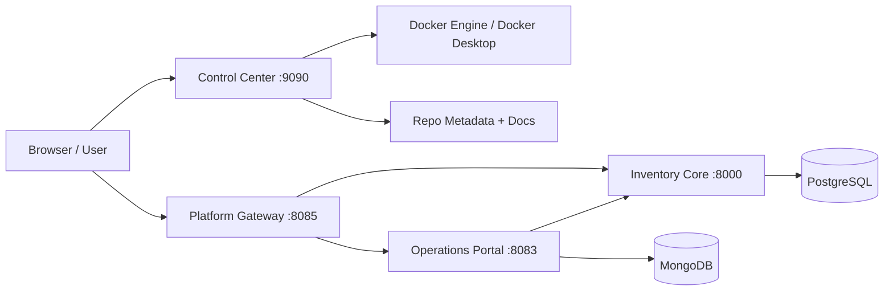
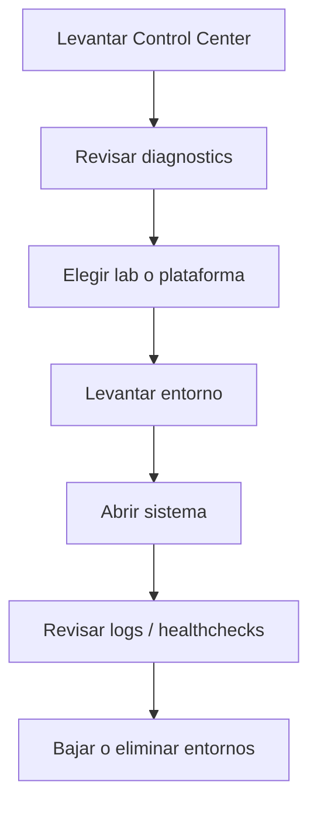

# 🏗️ Arquitectura — Docker Labs

> **Versión**: 1.4.0
> **Estado**: 🟢 Activo
> **Audiencia**: 👥 Técnico, DevOps, full stack
> **Objetivo**: Visión técnica del workspace y relación entre sus componentes

---

## 📌 Objetivo de arquitectura

La arquitectura del repositorio busca equilibrar tres cosas:

- aprendizaje práctico
- operación local clara
- evolución de algunos labs hacia productos modulares

## 📊 Estado arquitectónico

| Capa | Estado | Rol |
|---|---|---|
| `dashboard-control` | 🟢 Operativo | Control del workspace y diagnóstico |
| `05-postgres-api` | 🟢 Operativo | Core transaccional |
| `09-multi-service-app` | 🟢 Operativo | Portal operativo |
| `06-nginx-proxy` | 🟢 Operativo | Gateway |
| Labs complementarios | 🟡 Parcial | Capacidades e infraestructura |

## 🧱 Capas del sistema

```mermaid
flowchart LR
    Browser["Browser / User"] --> Control["Control Center :9090"]
    Browser --> Gateway["Platform Gateway :8085"]
    Gateway --> Core["Inventory Core :8000"]
    Gateway --> Portal["Operations Portal :8083"]
    Portal --> Core
    Control --> Docker["Docker Engine / Docker Desktop"]
    Control --> Repo["Repo Metadata + Docs"]
    Core --> Postgres[("PostgreSQL")]
    Portal --> Mongo[("MongoDB")]
```

## 🧠 Componentes principales

### 1. Control Center

| Atributo | Detalle |
|---|---|
| Componente | [dashboard-control/server.js](../dashboard-control/server.js) |
| Puerto | `9090` |
| Tecnología | Node.js + Express |

**Responsabilidades:**
- Listar y diagnosticar labs
- Ejecutar `docker compose` (start / stop / restart / rebuild / logs)
- Exponer `overview` y `diagnostics`
- Centralizar accesos y operaciones del workspace

---

### 2. Inventory Core

| Atributo | Detalle |
|---|---|
| Componente | [05-postgres-api/README.md](../05-postgres-api/README.md) |
| Puerto | `8000` |
| Tecnología | FastAPI + PostgreSQL 15 |

**Responsabilidades:**
- Clientes, productos, pedidos y stock
- Resumen operativo para dashboards
- Contratos REST documentados en Swagger

---

### 3. Operations Portal

| Atributo | Detalle |
|---|---|
| Componente | [09-multi-service-app/README.md](../09-multi-service-app/README.md) |
| Puerto | `8083` |
| Tecnología | Express.js + MongoDB + Nginx |

**Responsabilidades:**
- Mostrar datos operativos del core
- Ofrecer una cara más cercana al usuario operativo
- Persistir watchlist y contexto auxiliar

---

### 4. Platform Gateway

| Atributo | Detalle |
|---|---|
| Componente | [06-nginx-proxy/README.md](../06-nginx-proxy/README.md) |
| Puerto | `8085` |
| Tecnología | Nginx |

**Responsabilidades:**
- Unificar entrada al panel, core y portal
- Evitar experiencia fragmentada por puertos

## 🗂️ Taxonomía del repositorio

| Tipo | Qué incluye | Intención |
|---|---|---|
| `platform` | `05`, `06`, `09`, `dashboard-control` | Experiencia principal |
| `infra` | `04`, `07`, `08`, `11`, `12` | Capacidades complementarias |
| `starter` | `01`, `02`, `03`, `10` | Aprendizaje y base de futuros productos |

## 🔄 Flujo operativo principal

```mermaid
flowchart TD
    A["Levantar Control Center"] --> B["Revisar diagnostics"]
    B --> C["Elegir lab o plataforma"]
    C --> D["Levantar entorno"]
    D --> E["Abrir sistema"]
    E --> F["Revisar logs / healthchecks"]
    F --> G["Bajar o eliminar entornos"]
```

## 🧩 Principios de diseño

| Principio | Descripción |
|---|---|
| Problema concreto | Cada lab debe resolver un caso real, no ser un hello world |
| Documentación honesta | Los docs deben coincidir con lo que realmente entrega el sistema |
| Panel explicativo | El Control Center explica el entorno, no solo lo controla |
| Plataforma integrada | Los servicios principales deben sentirse como una plataforma, no como puertos aislados |

## 📚 Documentos relacionados

- [README](../README.md)
- [Dashboard Setup](DASHBOARD_SETUP.md)
- [Technical Specs](TECHNICAL_SPECS.md)
- [Platform Roadmap](PLATFORM_ROADMAP.md)
