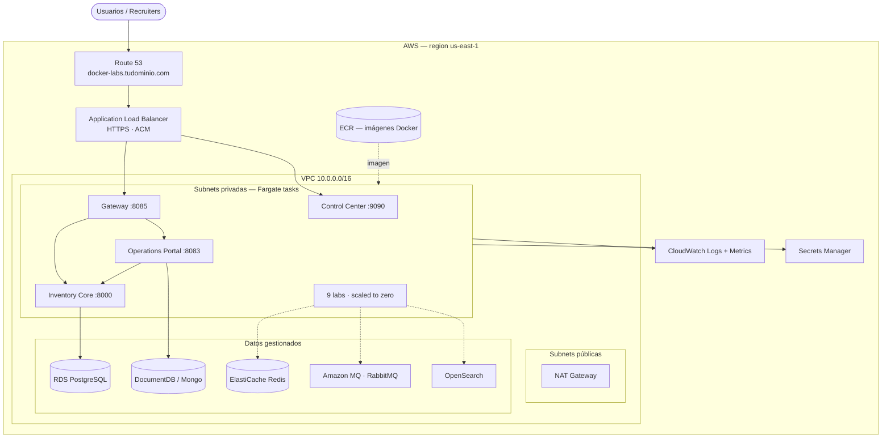
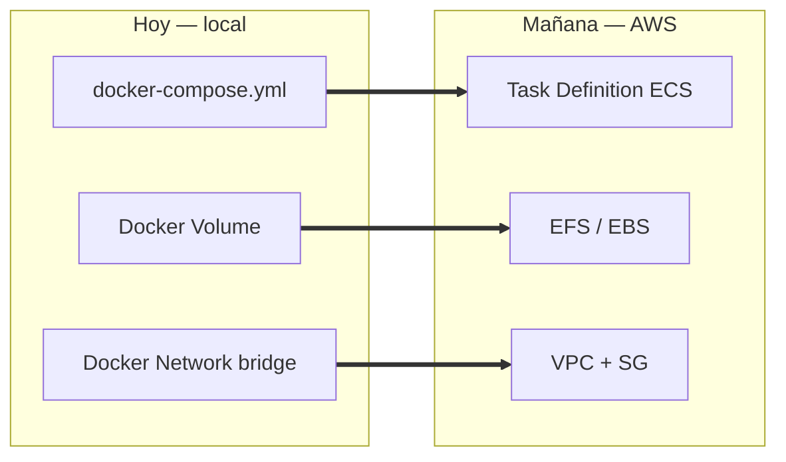
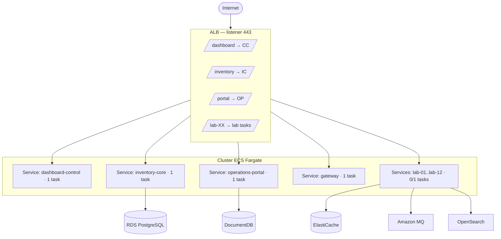
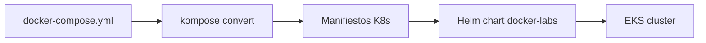
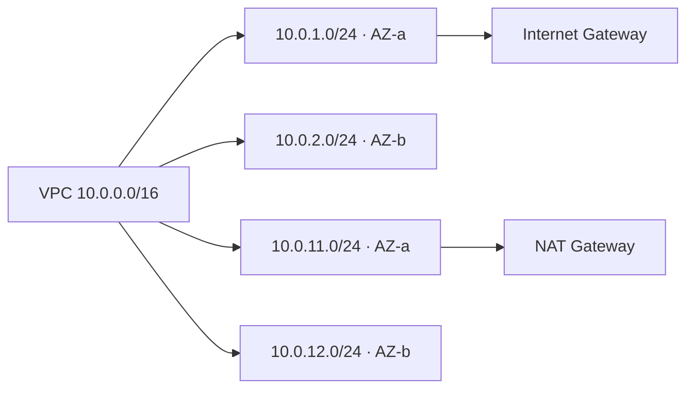
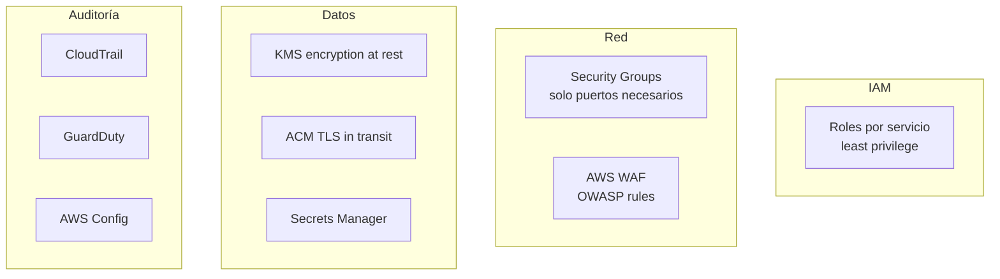
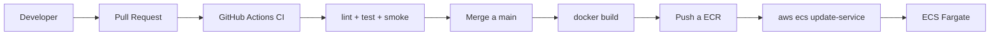
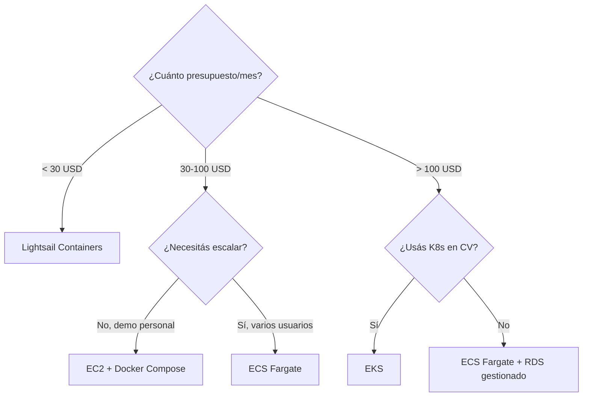

# Migración a AWS — Docker Labs

> Guía profunda para llevar la plataforma **Docker Labs** desde un entorno local Windows/Docker Desktop hacia **Amazon Web Services**, manteniendo el modelo modular de 13 labs y los 4 servicios de plataforma.

[](https://aws.amazon.com/)
[](https://aws.amazon.com/cdk/)
[]()
[]()

---

## TL;DR

- **Plataforma de 13 labs Docker** → contenedores listos para correr en AWS sin reescribir código.
- **No hay un único servicio AWS correcto**: hay 5 caminos válidos. Recomendamos **ECS Fargate** para producción y **EC2 + Docker Compose** para una migración 1:1 sin cambios.
- **Costo estimado mensual** (todo encendido 24/7, región `us-east-1`): entre **~30 USD** (Lightsail, didáctico) y **~280 USD** (ECS Fargate completo con RDS gestionado).
- **Apagar lo que no se usa** baja el costo a **<10 USD/mes** con On-Demand + scripts de start/stop.

---

## Tabla de contenidos

1. [Punto de partida](#punto-de-partida)
2. [Arquitectura objetivo](#arquitectura-objetivo)
3. [Opciones AWS — comparativa](#opciones-aws--comparativa)
4. [Camino recomendado: ECS Fargate](#camino-recomendado-ecs-fargate)
5. [Camino simple: EC2 + Docker Compose](#camino-simple-ec2--docker-compose)
6. [Camino enterprise: EKS](#camino-enterprise-eks)
7. [Camino didáctico: Lightsail Containers](#camino-didáctico-lightsail-containers)
8. [Camino serverless por lab: App Runner](#camino-serverless-por-lab-app-runner)
9. [Servicios AWS gestionados que reemplazan contenedores](#servicios-aws-gestionados-que-reemplazan-contenedores)
10. [Paso a paso — despliegue ECS Fargate](#paso-a-paso--despliegue-ecs-fargate)
11. [Costos detallados](#costos-detallados)
12. [Seguridad](#seguridad)
13. [Observabilidad](#observabilidad)
14. [CI/CD desde GitHub Actions](#cicd-desde-github-actions)
15. [Cleanup — destruir todo](#cleanup--destruir-todo)
16. [Decisión final](#decisión-final)

---

## Punto de partida

Hoy el repo entrega:

| Capa | Componentes |
|---|---|
| **Plataforma** | `dashboard-control` (Node, :9090), `05-postgres-api` (Python+PG, :8000), `09-multi-service-app` (Node+Mongo+Nginx, :8083), `06-nginx-proxy` (:8085) |
| **Labs independientes** | `01-node-api`, `02-php-lamp`, `03-python-api`, `04-redis-cache`, `07-rabbitmq-messaging`, `08-prometheus-grafana`, `10-go-api`, `11-elasticsearch-search`, `12-jenkins-ci` |
| **Tooling** | Docker Compose por lab, Makefile, scripts `start-*.sh/.cmd`, instalador Windows |

Todo está **dockerizado y con `docker-compose.yml`** por lab — esto es la clave: cualquier servicio AWS que ejecute contenedores nos sirve.

---

## Arquitectura objetivo

### Visión general



### Mapeo Docker Compose → AWS



---

## Opciones AWS — comparativa

| Servicio | Modelo | Curva | Costo base | Cuándo elegirlo |
|---|---|---|---|---|
| **EC2 + Docker Compose** | VM con Docker | Baja | ~15–40 USD/mes (t3.medium) | Migración 1:1, sin reescribir nada. Demo / portafolio. |
| **ECS Fargate** | Contenedores serverless | Media | ~0.04 USD/h por tarea | **Recomendado**: producción ligera, sin gestionar VMs. |
| **ECS sobre EC2** | Cluster gestionado, VMs propias | Media-Alta | ~30–60 USD/mes EC2 + ECS gratis | Quieres control de host y costos de Fargate te pesan. |
| **EKS (Kubernetes)** | K8s gestionado | Alta | 73 USD/mes plano de control + nodos | Equipo con experiencia K8s, multi-cluster, futuro multi-cloud. |
| **AWS App Runner** | Servicio HTTPS por contenedor | Muy baja | ~25 USD/mes por servicio activo | Un lab público (ej. `01-node-api`) sin red privada. |
| **Lightsail Containers** | PaaS de contenedores | Muy baja | 7 / 20 / 40 USD/mes flat | Demo barata, presupuesto fijo, didáctico. |
| **Elastic Beanstalk** | PaaS clásico | Baja | Solo paga EC2/RDS por debajo | Apps mono-contenedor con stack tradicional. |

> **Regla rápida**: si solo querés "ver el dashboard en internet" → Lightsail.
> Si querés "que se vea profesional y escale" → ECS Fargate.
> Si tu CV apunta a roles K8s → EKS.

---

## Camino recomendado: ECS Fargate

### Por qué

- **Sin servidores que parchar.** AWS ejecuta el contenedor, vos pagás vCPU/RAM por segundo.
- **Cada lab = una `Task Definition`.** Mapeo casi directo desde `docker-compose.yml`.
- **Escalado a cero**: los 9 labs independientes se mantienen en 0 réplicas y se levantan on-demand.
- **Integra nativo** con ALB, CloudWatch, Secrets Manager, ECR, IAM.

### Topología



---

## Camino simple: EC2 + Docker Compose

> "Tomá una EC2, instalá Docker, hacé `git clone`, `docker compose up`. Listo."

### Cuándo

- Querés llevar el repo tal cual a la nube.
- Una sola persona usa el ambiente.
- Presupuesto < 30 USD/mes.

### Pasos

```bash
# 1. Lanzar EC2 (Amazon Linux 2023, t3.medium, 30 GB gp3)
aws ec2 run-instances \
  --image-id ami-xxxxxxxx \
  --instance-type t3.medium \
  --key-name docker-labs-key \
  --security-group-ids sg-xxxxxxx \
  --subnet-id subnet-xxxxxxx

# 2. SSH y bootstrap
ssh -i docker-labs-key.pem ec2-user@<ip>
sudo dnf install -y docker git
sudo systemctl enable --now docker
sudo usermod -aG docker ec2-user
sudo curl -L "https://github.com/docker/compose/releases/latest/download/docker-compose-linux-x86_64" \
  -o /usr/local/bin/docker-compose && sudo chmod +x /usr/local/bin/docker-compose

# 3. Clonar y arrancar
git clone https://github.com/vladimiracunadev-create/docker-labs.git
cd docker-labs
docker compose -f 05-postgres-api/docker-compose.yml up -d
docker compose -f 09-multi-service-app/docker-compose.yml up -d
docker compose -f 06-nginx-proxy/docker-compose.yml up -d
```

**Ahorro**: parar la instancia de noche con EventBridge → -60% costo.

---

## Camino enterprise: EKS

| Componente | Servicio AWS |
|---|---|
| Plano de control | EKS (73 USD/mes) |
| Nodos | EC2 (managed node group) o Fargate Profiles |
| Ingress | ALB Controller |
| Secrets | External Secrets + Secrets Manager |
| Observabilidad | Container Insights / Prometheus + Grafana (lab 08 nativo) |



> El repo ya tiene [docs/KUBERNETES_DEPLOYMENT.md](KUBERNETES_DEPLOYMENT.md) — es el punto de partida natural para EKS.

---

## Camino didáctico: Lightsail Containers

| Plan | vCPU | RAM | Precio/mes |
|---|---|---|---|
| Nano | 0.25 | 0.5 GB | 7 USD |
| Micro | 0.25 | 1 GB | 10 USD |
| Small | 0.5 | 2 GB | 20 USD |
| Medium | 1 | 4 GB | 40 USD |

```bash
aws lightsail create-container-service \
  --service-name docker-labs \
  --power small --scale 1

aws lightsail push-container-image \
  --service-name docker-labs \
  --label dashboard \
  --image dashboard-control:latest
```

**Limitación**: Lightsail expone solo un endpoint público por servicio. Bueno para 1–2 labs, no para los 13.

---

## Camino serverless por lab: App Runner

Ideal para exponer **un único lab** como demo pública (`01-node-api`, `03-python-api`, `10-go-api`).

```bash
aws apprunner create-service \
  --service-name lab-01-node-api \
  --source-configuration '{
    "ImageRepository": {
      "ImageIdentifier": "<account>.dkr.ecr.us-east-1.amazonaws.com/lab-01:latest",
      "ImageRepositoryType": "ECR",
      "ImageConfiguration": { "Port": "3000" }
    }
  }' \
  --instance-configuration '{"Cpu":"1 vCPU","Memory":"2 GB"}'
```

Costo: ~25 USD/mes por servicio activo, **escala a cero** cuando nadie lo consulta.

---

## Servicios AWS gestionados que reemplazan contenedores

Migrar no es solo "mover el contenedor"; muchos componentes pueden delegarse a un servicio gestionado y bajar carga operacional:

| Componente actual | Reemplazo AWS gestionado | Beneficio |
|---|---|---|
| PostgreSQL contenedor (lab 05) | **RDS PostgreSQL** (db.t4g.micro) | Backups, HA, parches automáticos |
| MongoDB contenedor (lab 09) | **DocumentDB** o Atlas en AWS | Compatible Mongo API |
| Redis contenedor (lab 04) | **ElastiCache Redis** | Cluster mode, snapshots |
| RabbitMQ contenedor (lab 07) | **Amazon MQ for RabbitMQ** | HA multi-AZ |
| Elasticsearch contenedor (lab 11) | **OpenSearch Service** | Sin operar el cluster |
| Jenkins contenedor (lab 12) | **CodePipeline + CodeBuild** | Nativo IAM, sin mantener Jenkins |
| Prometheus + Grafana (lab 08) | **AMP + AMG** (Amazon Managed Prometheus / Grafana) | Sin operar TSDB |
| Nginx proxy (lab 06) | **ALB / CloudFront** | TLS, WAF, edge caching |
| Volúmenes Docker | **EFS** (compartido) o **EBS** (por task) | Persistencia gestionada |
| Imágenes Docker locales | **ECR** | Repos privados, scan de vulnerabilidades |
| `.env` y secretos | **Secrets Manager** / SSM Parameter Store | Rotación automática |
| DNS / dominio | **Route 53** | Health checks, failover |
| Certificados TLS | **ACM** | Gratuitos, renovación automática |

---

## Paso a paso — despliegue ECS Fargate

### Prerrequisitos

- Cuenta AWS con MFA activado
- AWS CLI v2 configurado (`aws configure`)
- Docker local
- Terraform ≥ 1.6 **o** AWS CDK v2 (opcional pero recomendado)

### 1. Preparar imágenes en ECR

```bash
# Crear repos (uno por lab)
for lab in dashboard-control inventory-core operations-portal gateway \
           lab-01-node lab-03-python lab-04-redis lab-10-go; do
  aws ecr create-repository --repository-name docker-labs/$lab
done

# Login
aws ecr get-login-password --region us-east-1 | \
  docker login --username AWS --password-stdin <account>.dkr.ecr.us-east-1.amazonaws.com

# Build + push (ejemplo dashboard-control)
docker build -t docker-labs/dashboard-control ./dashboard-control
docker tag docker-labs/dashboard-control:latest \
  <account>.dkr.ecr.us-east-1.amazonaws.com/docker-labs/dashboard-control:latest
docker push <account>.dkr.ecr.us-east-1.amazonaws.com/docker-labs/dashboard-control:latest
```

### 2. Red — VPC + Subnets



Stack mínimo Terraform:

```hcl
module "vpc" {
  source = "terraform-aws-modules/vpc/aws"
  name   = "docker-labs-vpc"
  cidr   = "10.0.0.0/16"
  azs    = ["us-east-1a", "us-east-1b"]
  public_subnets  = ["10.0.1.0/24", "10.0.2.0/24"]
  private_subnets = ["10.0.11.0/24", "10.0.12.0/24"]
  enable_nat_gateway = true
  single_nat_gateway = true   # ahorro: 1 NAT en vez de 2
}
```

### 3. Cluster ECS + Task Definitions

```hcl
resource "aws_ecs_cluster" "this" {
  name = "docker-labs"
  setting {
    name  = "containerInsights"
    value = "enabled"
  }
}

resource "aws_ecs_task_definition" "dashboard" {
  family                   = "dashboard-control"
  cpu                      = "256"
  memory                   = "512"
  network_mode             = "awsvpc"
  requires_compatibilities = ["FARGATE"]
  execution_role_arn       = aws_iam_role.ecs_execution.arn

  container_definitions = jsonencode([{
    name  = "dashboard"
    image = "${aws_ecr_repository.dashboard.repository_url}:latest"
    portMappings = [{ containerPort = 9090, protocol = "tcp" }]
    logConfiguration = {
      logDriver = "awslogs"
      options = {
        awslogs-group         = "/ecs/docker-labs/dashboard"
        awslogs-region        = "us-east-1"
        awslogs-stream-prefix = "ecs"
      }
    }
  }])
}
```

### 4. ALB + Target Groups

Un listener HTTPS:443 con reglas por path: `/dashboard*`, `/inventory*`, `/portal*`, `/lab-*`.

### 5. Datos gestionados

```hcl
module "rds_postgres" {
  source         = "terraform-aws-modules/rds/aws"
  identifier     = "docker-labs-pg"
  engine         = "postgres"
  engine_version = "15"
  instance_class = "db.t4g.micro"
  allocated_storage = 20
  db_name        = "inventory"
  username       = "postgres"
  manage_master_user_password = true   # → Secrets Manager
  vpc_security_group_ids      = [aws_security_group.rds.id]
  db_subnet_group_name        = module.vpc.database_subnet_group
}
```

### 6. Conectar contenedores a Secrets Manager

En la `Task Definition`:

```json
"secrets": [
  { "name": "DATABASE_URL", "valueFrom": "arn:aws:secretsmanager:us-east-1:...:secret:rds!cluster-..." }
]
```

### 7. DNS + TLS

```bash
aws acm request-certificate \
  --domain-name docker-labs.tudominio.com \
  --validation-method DNS

aws route53 change-resource-record-sets ... # ALIAS → ALB
```

### 8. Verificación

```bash
curl -I https://docker-labs.tudominio.com/dashboard
# 200 OK → Control Center en producción
```

---

## Costos detallados

> Precios `us-east-1`, mayo 2026, tarifa On-Demand. **Estimaciones**: la factura real depende de tráfico, almacenamiento y horas encendido.

### Escenario A — Demo barata (Lightsail)

| Recurso | Cantidad | Costo/mes |
|---|---|---|
| Lightsail Container Service Small | 1 | 20 USD |
| Lightsail DB (PostgreSQL Micro) | 1 | 15 USD |
| Tráfico salida (50 GB) | — | incluido |
| **Total** | | **~35 USD** |

### Escenario B — EC2 single-host

| Recurso | Cantidad | Costo/mes |
|---|---|---|
| EC2 t3.medium 24/7 | 1 | ~30 USD |
| EBS gp3 30 GB | 1 | 2.4 USD |
| Elastic IP | 1 | 3.6 USD |
| Data transfer out (10 GB) | — | 0.9 USD |
| **Total** | | **~37 USD** |
| Misma EC2 apagada 12h/día | | **~17 USD** |

### Escenario C — ECS Fargate completo (recomendado)

| Recurso | Cantidad | Costo/mes |
|---|---|---|
| Fargate (4 tasks plataforma · 0.25 vCPU · 0.5 GB · 24/7) | 4 | ~30 USD |
| Fargate (9 labs · scale-to-zero, ~10h/mes c/u) | 9 | ~5 USD |
| ALB | 1 | 16 USD + LCU |
| NAT Gateway | 1 | 32 USD + datos |
| RDS PostgreSQL db.t4g.micro | 1 | 13 USD |
| DocumentDB t4g.medium | 1 | ~60 USD |
| ElastiCache Redis cache.t4g.micro | 1 | 12 USD |
| Amazon MQ RabbitMQ mq.t3.micro | 1 | 17 USD |
| OpenSearch t3.small.search | 1 | 25 USD |
| ECR storage 10 GB | — | 1 USD |
| CloudWatch Logs 10 GB ingestión | — | 5 USD |
| Secrets Manager 10 secretos | — | 4 USD |
| Route 53 hosted zone | 1 | 0.5 USD |
| **Total mensual** | | **~220 USD** |
| **Reduciendo a solo plataforma** (sin DocDB, MQ, OS) | | **~120 USD** |

### Escenario D — EKS

| Recurso | Costo/mes |
|---|---|
| EKS Control Plane | 73 USD |
| 2× EC2 t3.medium worker nodes | ~60 USD |
| ALB Controller + ALB | ~20 USD |
| RDS / DocDB / etc. | igual a Escenario C |
| **Total base** | **~280–350 USD** |

### Free Tier — primeros 12 meses

- EC2: 750h/mes t2.micro o t3.micro **gratis**
- RDS: 750h/mes db.t3.micro + 20 GB **gratis**
- ECR: 500 MB **gratis**
- CloudWatch: 5 GB logs + 10 métricas custom **gratis**
- ALB: **NO** está en free tier
- Fargate: **NO** está en free tier

> Con cuenta nueva + EC2 single-host + RDS micro → **~5 USD/mes** los primeros 12 meses.

### Reglas de oro para no quemar plata

1. **Apagar lo que no se usa** — EventBridge + Lambda para `stop-instances` a las 22:00.
2. **Single NAT Gateway** en lugar de uno por AZ → ahorro 32 USD/mes.
3. **Spot Fargate** para labs no críticos → -70% costo cómputo.
4. **Savings Plans** Compute → -30% si te quedás 1 año.
5. **Budgets + Alarmas** en CloudWatch a 50/80/100% del presupuesto.

---

## Seguridad



Checklist mínimo:

- [ ] Cuenta root con MFA, no usar para operar
- [ ] Usuarios IAM individuales o SSO con MFA
- [ ] Sin credenciales hardcoded — todo en Secrets Manager
- [ ] Security Groups con regla "deny all" por defecto
- [ ] Cifrado at-rest activado en RDS, EBS, S3, ECR
- [ ] CloudTrail habilitado en todas las regiones
- [ ] GuardDuty activo (~3 USD/mes y vale la pena)
- [ ] Budgets con alertas

---

## Observabilidad

| Métrica | Origen | Destino |
|---|---|---|
| Logs aplicación | stdout contenedor | CloudWatch Logs |
| Métricas CPU/RAM task | ECS Container Insights | CloudWatch |
| Health checks | ALB | CloudWatch + SNS |
| Trazas | OpenTelemetry SDK | AWS X-Ray |
| Dashboards | Grafana (lab 08) o AMG | Web |

El lab `08-prometheus-grafana` puede seguir corriendo en ECS y scrapear los demás vía service discovery (Cloud Map).

---

## CI/CD desde GitHub Actions



`.github/workflows/deploy-aws.yml` (extracto):

```yaml
- uses: aws-actions/configure-aws-credentials@v4
  with:
    role-to-assume: arn:aws:iam::<account>:role/github-actions-deploy
    aws-region: us-east-1

- run: |
    aws ecr get-login-password | docker login --username AWS --password-stdin <ecr>
    docker build -t <ecr>/docker-labs/dashboard:${{ github.sha }} ./dashboard-control
    docker push <ecr>/docker-labs/dashboard:${{ github.sha }}
    aws ecs update-service --cluster docker-labs \
      --service dashboard-control --force-new-deployment
```

> Usar **OIDC** (rol federado) en lugar de access keys → cero secretos en GitHub.

---

## Cleanup — destruir todo

```bash
# Si usaste Terraform
terraform destroy -auto-approve

# Si usaste consola, borrar en este orden:
# 1. ECS services (set desired-count=0, luego delete)
# 2. ECS cluster
# 3. ALB + target groups
# 4. RDS / DocumentDB / ElastiCache (snapshots opcionales)
# 5. NAT Gateway
# 6. Elastic IPs liberadas
# 7. ECR repositories (force=true para borrar imágenes)
# 8. CloudWatch log groups
# 9. VPC
```

> **Trampa común**: NAT Gateway sigue cobrando hasta que lo borres. Revisar el reporte de Cost Explorer 24h después.

---

## Decisión final



**Nuestra recomendación para este repo**:

1. **Fase 1 (semana 1)** — EC2 t3.medium con Docker Compose. Demo viva, costo bajo, cero refactor.
2. **Fase 2 (mes 1)** — Migrar `05-postgres-api` a RDS y `09-multi-service-app` a DocumentDB. Resto sigue en EC2.
3. **Fase 3 (mes 3)** — Pasar plataforma (4 servicios) a ECS Fargate detrás de ALB con dominio + TLS.
4. **Fase 4 (opcional)** — Resto de labs como tareas Fargate scale-to-zero, expuestos bajo subpaths.

Esta progresión evita el big-bang y permite **probar cada capa de AWS** antes de pagarla.

---

## Referencias

- [docs/KUBERNETES_DEPLOYMENT.md](KUBERNETES_DEPLOYMENT.md) — base para EKS
- [docs/TECHNICAL_SPECS.md](TECHNICAL_SPECS.md) — puertos y stacks que mapean a Task Definitions
- [docs/ARCHITECTURE.md](ARCHITECTURE.md) — arquitectura local actual
- [AWS Pricing Calculator](https://calculator.aws/) — modelar tu propio escenario
- [AWS Well-Architected Framework](https://aws.amazon.com/architecture/well-architected/)
- [Copilot CLI](https://aws.github.io/copilot-cli/) — alternativa a Terraform para ECS
