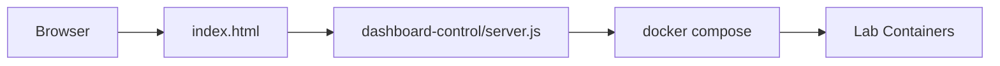

# Control Center Setup

Esta guia documenta el nuevo panel principal de `docker-labs`: un control center web que permite inspeccionar el estado real de los laboratorios y ejecutar acciones Docker desde una sola interfaz.

## Objetivo

El panel existe para resolver tres problemas del repositorio:

- evitar levantar labs a ciegas desde terminal
- centralizar estado, accesos y logs
- transformar el repositorio en una plataforma operable, no solo en una coleccion de ejemplos

## Como Funciona

El control center tiene dos capas:

1. `index.html` como interfaz principal
2. `dashboard-control/server.js` como API local que ejecuta `docker compose`

El backend local:

- descubre servicios por `docker compose config --services`
- consulta contenedores por `docker compose ps --format json`
- ejecuta `up`, `down`, `restart` y `logs`
- devuelve un overview agregado para la web

## Requisitos

- Docker Desktop o Docker Engine activo
- Node.js 20+ disponible en la maquina
- permisos suficientes para que el proceso local pueda ejecutar `docker`

### Nota Importante para Windows

Si Docker en tu equipo requiere privilegios elevados, inicia el control center desde una terminal con permisos equivalentes. El frontend puede abrirse normalmente en el navegador, pero el backend necesita el mismo nivel de acceso que tu cliente Docker.

## Inicio Rapido

### Windows

```bat
cd C:\docker-labs\docker-labs
scripts\start-control-center.cmd
```

### macOS / Linux / PowerShell

```bash
cd /ruta/al/repositorio
node dashboard-control/server.js
```

Luego abre:

- [http://localhost:9090](http://localhost:9090)

## Funciones Disponibles

El panel permite:

- listar todos los labs del repositorio
- ver estado `healthy`, `running`, `stopped` o `degraded`
- abrir URLs publicadas por cada lab
- levantar un lab individual
- reiniciar un lab
- detener un lab
- reconstruir un lab con `--build`
- inspeccionar logs recientes
- revisar un resumen global del estado del repositorio

## Flujo Recomendado

1. abre el control center
2. revisa el overview de estado
3. inicia un laboratorio puntual
4. valida servicios y healthchecks desde el panel lateral
5. abre el servicio en su URL publicada
6. usa logs cuando un stack no quede saludable

## Arquitectura del Control Center



## Verificacion

### API del panel

```bash
curl http://localhost:9090/api/overview
```

### Accion remota sobre un lab

```bash
curl -X POST http://localhost:9090/api/labs/05-postgres-api/start ^
  -H "Content-Type: application/json" ^
  -d "{}"
```

### Logs de un lab

```bash
curl -X POST http://localhost:9090/api/labs/05-postgres-api/logs ^
  -H "Content-Type: application/json" ^
  -d "{\"tail\":40}"
```

## Troubleshooting

### El panel carga pero no puede controlar Docker

Causa probable:
- el proceso Node no tiene el mismo nivel de permisos que Docker

Solucion:
- reinicia el backend del panel con permisos adecuados

### Puerto 9090 ocupado

Solucion:
- libera el puerto, o ejecuta el servidor con otra variable:

```bash
DASHBOARD_PORT=9191 node dashboard-control/server.js
```

### Un lab aparece como `stopped` aunque exista su compose

Eso significa que el compose fue leido correctamente, pero no hay contenedores activos en ese proyecto.

### Un lab aparece como `degraded`

Eso significa que hay contenedores corriendo, pero con healthcheck no saludable o en estado parcial.

## Relacion con el Dashboard Legacy

Los archivos `docker-compose-dashboard*.yml` y la configuracion Nginx siguen en el repositorio como referencia historica. El flujo recomendado para operar el proyecto ahora es el control center local, porque puede ejecutar acciones reales sobre Docker y no solo mostrar un HTML estatico.
